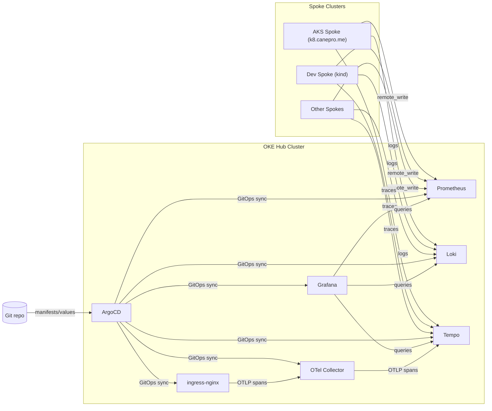

# OKE Observability Hub

> **Decommissioned 2026-08-03.** The live OKE hub, worker nodes, load balancers,
> block volumes, and dedicated VCN were removed to release OCI Always Free
> capacity. This repository is retained as historical GitOps source and as a
> possible rebuild reference; pushing `main` no longer deploys anything.
> See [OKE-DECOMMISSION-RUNBOOK.md](hub-docs/OKE-DECOMMISSION-RUNBOOK.md) for
> recovery points, verification, and safe reconstruction notes.

A historical centralized observability platform for Oracle Kubernetes Engine
(OKE), designed to aggregate metrics, logs, and traces across multi-cluster
environments.

## Overview

This repository retains the former GitOps source for the observability stack:

| Component | Purpose | Storage |
|-----------|---------|---------|
| **Grafana** | Unified visualization and dashboards | Ephemeral (emptyDir); dashboards provisioned from git |
| **Prometheus** | Metrics collection and alerting | Block Volume (50Gi) |
| **Loki** | Log aggregation | OCI Object Storage (S3) |
| **Tempo** | Distributed tracing | OCI Object Storage (S3) |
| **OpenTelemetry Collector** | Receives OTLP traces and forwards to Tempo | Ephemeral (deployment) |
| **NGINX Ingress** | Single LoadBalancer + HTTPS routing | OCI NLB (Always Free tier limits apply) |
| **ArgoCD** | GitOps continuous delivery | - |

## Architecture



### Endpoints

The former Grafana, Argo CD, Jenkins, and ingestion endpoints were retired with
the cluster. Their DNS records must remain absent unless a replacement service
is deliberately deployed and accepted.

## Quick Start

`docs/QUICKSTART.md` is a historical deployment checklist. Do not run it as a
live operations procedure without first approving a new target architecture,
cost boundary, DNS plan, and recovery path.

## Repository Structure

```
├── argocd/              # ArgoCD application manifests
│   ├── applications/    # Individual component definitions
│   └── bootstrap-oke.yaml
├── helm/                # Helm values for each component
├── k8s/                 # Raw Kubernetes manifests
├── terraform/           # OKE infrastructure as code
├── scripts/             # Operational scripts
├── docs/                # Integration and troubleshooting guides
└── hub-docs/            # Hub-specific documentation
```

## GitOps Workflow

When the hub was active, the stack was managed declaratively via Argo CD. The
repository currently has no live Argo CD consumer and Terraform remote state is
intentionally empty.

1. **Modify** - Edit manifests in `argocd/applications/` or values in `helm/`
2. **Commit** - Push changes to `main` branch
3. **Sync** - ArgoCD automatically detects and applies changes

### Important Notes

- ArgoCD watches the `main` branch - every push triggers reconciliation
- For PVC-backed components (Grafana, Prometheus), take snapshots before upgrades
- Grafana admin credentials and `secret_key` are sourced from Infisical via External Secrets Operator (`k8s/external-secrets/`)
- Run `./scripts/validate-deployment.sh` after changes to verify health

## Documentation

| Document | Description |
|----------|-------------|
| [hub-docs/README.md](hub-docs/README.md) | Component versions and architecture overview |
| [hub-docs/OKE-DECOMMISSION-RUNBOOK.md](hub-docs/OKE-DECOMMISSION-RUNBOOK.md) | Current state, recovery points, teardown lessons, and rebuild gate |
| [hub-docs/OPERATIONS-HUB.md](hub-docs/OPERATIONS-HUB.md) | Retention policies, storage management |
| [hub-docs/TRACING-ROLLOUT-CHECKLIST.md](hub-docs/TRACING-ROLLOUT-CHECKLIST.md) | GitOps checklist for phased service tracing rollout |
| [hub-docs/TRACING-SERVICE-ONBOARDING-TEMPLATE.md](hub-docs/TRACING-SERVICE-ONBOARDING-TEMPLATE.md) | Per-service tracing onboarding template/checklist |
| [hub-docs/ARGOCD-RUNBOOK.md](hub-docs/ARGOCD-RUNBOOK.md) | ArgoCD operations and troubleshooting |
| [docs/JENKINS-MIGRATION-SUMMARY.md](docs/JENKINS-MIGRATION-SUMMARY.md) | Jenkins migration to OKE and split-agent summary |
| [docs/JENKINS-503-TROUBLESHOOTING.md](docs/JENKINS-503-TROUBLESHOOTING.md) | Jenkins (OKE) operational troubleshooting |
| [docs/QUICKSTART.md](docs/QUICKSTART.md) | Getting started guide |
| [docs/CONFIGURATION.md](docs/CONFIGURATION.md) | Integration guide for external clusters |
| [docs/MULTI-CLUSTER-SETUP-COMPLETE.md](docs/MULTI-CLUSTER-SETUP-COMPLETE.md) | Hub-and-spoke setup guide |
| [GITOPS-HANDOVER.md](GITOPS-HANDOVER.md) | Operational handover document |
| [VERSION-TRACKING.md](VERSION-TRACKING.md) | Software version tracking |

## CI/CD

### GitHub Actions

The repository includes automated quality gates (`.github/workflows/devops-quality-gate.yml`):
- YAML linting
- Kubernetes manifest security scanning (kube-linter)
- ArgoCD application validation

**Troubleshooting CI Failures:**
If workflows fail with "no steps executed" or jobs sit in queue for extended periods:
1. Check [GitHub Status](https://www.githubstatus.com/) for Actions outages
2. Verify runner availability issues are not widespread
3. Re-run failed workflows once service is restored

All jobs have timeout limits (5-15 minutes) to fail fast when runners are unavailable.

### Jenkins

Jenkins no longer runs on OKE. Its former controller data is retained only in
the named OCI full-volume backup recorded in the decommission runbook.
Historical pipelines in `.jenkins/` provide:
- Terraform format, validate, and (when OCI parameters are set) plan
- Kubernetes manifest validation
- Security scanning and version checking

PR and branch builds run format/validate only unless OCI job parameters are configured. See [.jenkins/README.md](.jenkins/README.md) for OCI credentials and [docs/JENKINS-MIGRATION-SUMMARY.md](docs/JENKINS-MIGRATION-SUMMARY.md) for migration and troubleshooting.

## Infrastructure

| Resource | Current state |
|----------|---------------|
| OKE cluster | Deleted |
| A1 worker instances and boot volumes | Deleted |
| Jenkins and Prometheus source volumes | Deleted after full backups became `AVAILABLE` |
| OCI network load balancers and dedicated VCN | Deleted |
| Terraform managed-resource count | `0` |
| Loki/Tempo Object Storage and recovery backups | Retained; not part of the destroy plan |

## License

This project is maintained for educational and portfolio purposes.
