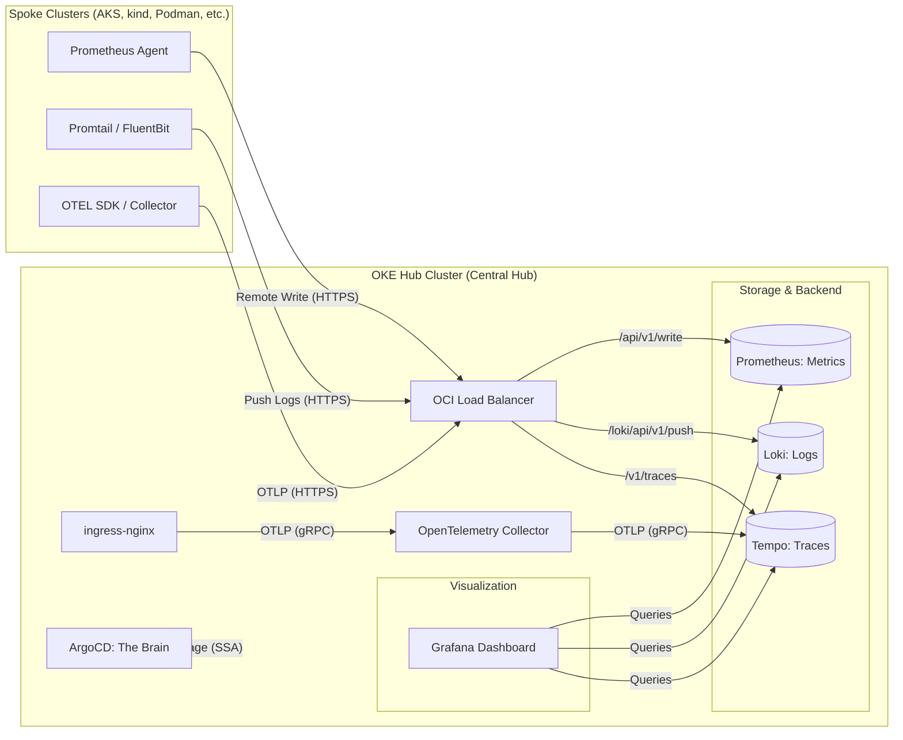

# Observability Hub Data Flow

[](https://mermaid.live/view#pako:dZPBbqMwEIbvPMUoUisiNRut9pbDSoF0t1WIwha0e7D2MCEuWDEY2aaV-vQdmySEqPEBDzOfZ35mTKmxrSB5CYCW6XalfzetOnADbJI5A2LZGcu1gXD9wzxAqvY1Ng_AbfFtOvnvj7qValUvS95Y5ixuK94Z8I6BSdRBDIxFIWEOv2RHnkhccMu2zTUW3LBt_phAtloTFyspeWGV7jne7IOx7qrbkejt-hGeyDrKhjCm7Bqlc17qTSK2jZ9JEu4hQolNwfUQPRvn7DssDlQTWEYSsORwT8e8azjl1kbUQrNwaMICNtxqUZjpGHTNYKF7Lsgur8M5r1vFQr8toG_HBeI-_7bYN2E6lOIDrVANsL-Xr-MyvzW-YoPsuMMKTbVTqPfjUsNodKniFes30lVxiDSK5mood3eUySINV70Ho-sBsxlMXnitLId_WtAzfMrzNJtOKPKTxhKMborH085Uvkdfsufb4tltnqRfYn3eyENzbMX87fv83QnoKT-3ESNJwwlsScExG3lHGEWtL9_H_cCGgqe-OvRPx7U4cUO9m8i51E3iqlg_FY9lXL7ONnSIbmqYZctjL-gfCT4B)

This diagram visualizes how data flows from various Spoke clusters and external applications into the Central OKE Hub.

## Flow Description
1. **Ingestion**: External agents (Prometheus Agent, Promtail) push telemetry via the OCI Load Balancer using HTTPS and Basic Auth.
   - Hub ingress traces are generated from real ingress traffic (`ingress-nginx`) and forwarded to Tempo via an in-cluster OpenTelemetry Collector.
2. **Persistence**: The Hub components store high-velocity data (metrics) on Block Volumes and high-volume data (logs/traces) on OCI Object Storage.
3. **Visualization**: Grafana queries the backend services internally within the cluster.
4. **Management**: ArgoCD monitors the repository and applies updates to the Hub cluster itself via Server-Side Apply.
