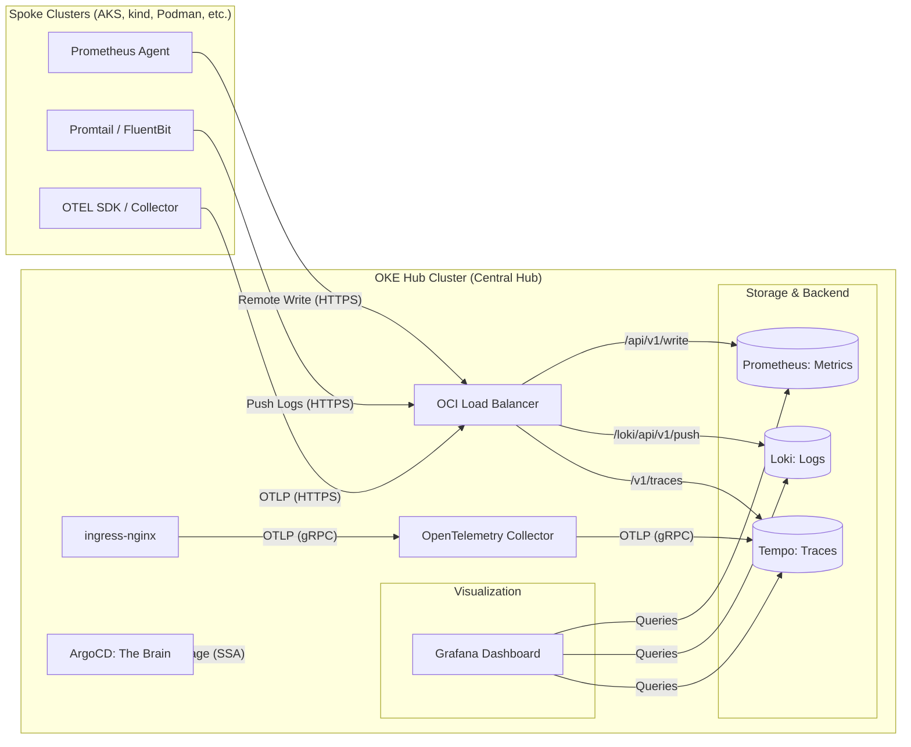

# Observability Hub Data Flow

[](https://mermaid.live/view#pako:dZNLj5swFIX3_IorpKmIlDTqNotKCZl2RiGFBtQurC4c4oAVYiMbZtr--l4bwquJF_j1mXs4PmSKljkEBwew6fqY2bku5YVp4samB7-odcWUBm-9i-dw4eI0h0ierlTMgVXpx5n7y543LVLyus6YqIgZsSpntQa70DOBvPCeqSgvYAlfihpXNnzArcsyUTRFJWHyHEC83SHny6JgaSVVwzFxcsbi8_pI3HD3DC_18aYdPB9frmhhFodygw0J_VdURE-woQUVKVP97qvIFNP6W8bFb8KbyUKYWc-ECSs6TSQsmcAFhl-u_ky1mtYNOr1Hml7wK9BtBGnG4AMqsUsDnabt-ZUr4vW-rmCPZXiqZ2PQ-Es881zhOJtuJ-xaSuLZbgWNwwPEOPpY7RvXNS34X1pxKYj7Yzid6P2q6JkKStoetlTnR0nVaVyrv26VSX9Lmg6F5Qw2inIxueinJ3xTRTEw8t0ZRQ4WC3AP7CorBj8Vx6f3kiRRPHNx5zPetTNKn8WjWufWpLtsl0DLhkkQ3cVuutq8ACbtfOap6VOMDXiKYfR0SYWGM6o1GYU2TzNnmrRBrewQ-W2pUc6c_5J3_5C948a2YGORJS358u3T8t3400A2VyOmQItuYIkGtR-LqyMMdyvrzrBY58ft2g36vWaK37i-3kOkK_WQmBRrQmOxmBXnxR4P4a_kxfG6tQIt_wc)

This diagram visualizes how data flows from various Spoke clusters and external applications into the Central OKE Hub.

```mermaid
graph LR
    subgraph spokes["Spoke Clusters (AKS, kind, Podman, etc.)"]
        PromAgent[Prometheus Agent]
        LokiAgent[Promtail / FluentBit]
        AppTraces[OTEL SDK / Collector]
    end

    subgraph hub["OKE Hub Cluster (Central Hub)"]
        LB[OCI Load Balancer]
        IngressNginx[ingress-nginx]
        OTelCollector[OpenTelemetry Collector]
        
        subgraph backend["Storage & Backend"]
            Mimir[(Prometheus: Metrics)]
            Loki[(Loki: Logs)]
            Tempo[(Tempo: Traces)]
        end
        
        subgraph visualization["Visualization"]
            Grafana[Grafana Dashboard]
        end

        ArgoCD[ArgoCD: The Brain]
    end

    %% Data Flow
    PromAgent -- "Remote Write (HTTPS)" --> LB
    LokiAgent -- "Push Logs (HTTPS)" --> LB
    AppTraces -- "OTLP (HTTPS)" --> LB
    
    %% Ingress traffic tracing (real spans from hub ingress)
    IngressNginx -- "OTLP (gRPC)" --> OTelCollector
    OTelCollector -- "OTLP (gRPC)" --> Tempo

    LB -- "/api/v1/write" --> Mimir
    LB -- "/loki/api/v1/push" --> Loki
    LB -- "/v1/traces" --> Tempo
    
    Grafana -- "Queries" --> Mimir
    Grafana -- "Queries" --> Loki
    Grafana -- "Queries" --> Tempo
    
    ArgoCD -- "Self-Manage (SSA)" --> hub
```

## Flow Description
1. **Ingestion**: External agents (Prometheus Agent, Promtail) push telemetry via the OCI Load Balancer using HTTPS and Basic Auth.
   - Hub ingress traces are generated from real ingress traffic (`ingress-nginx`) and forwarded to Tempo via an in-cluster OpenTelemetry Collector.
2. **Persistence**: The Hub components store high-velocity data (metrics) on Block Volumes and high-volume data (logs/traces) on OCI Object Storage.
3. **Visualization**: Grafana queries the backend services internally within the cluster.
4. **Management**: ArgoCD monitors the repository and applies updates to the Hub cluster itself via Server-Side Apply.
