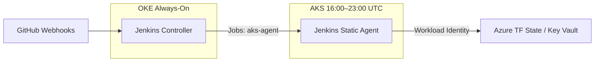

# Jenkins Split-Agent Hybrid Plan

**Goal:** Run the Jenkins Controller on OKE (24/7) and a static Jenkins agent on AKS (only when cluster is up). Azure jobs keep using Workload Identity on AKS; webhooks and controller availability no longer depend on AKS.

---

## 1. Current State & Prerequisites

### 1.1 Current State (AKS / Ops Repo)

- **Controller:** Deployed on AKS via ArgoCD (e.g. `argocd/applications/aks-jenkins.yaml`), configured by `jenkins-values.yaml` (JCasC, dynamic K8s agents: default, terraform, helm, etc.).
- **Identity:** `jenkins` service account on AKS has Workload Identity annotations (UAMI `fe3d3d95-fb61-4a42-8d82-ec0852486531`); see `jenkins-values.yaml` and `.jenkins/WORKLOAD_IDENTITY_SETUP.md` (in ops repo).
- **Secrets:** Admin + GitHub token from Azure Key Vault via ESO (e.g. `ops/secrets/externalsecret-jenkins.yaml`).
- **Shutdown:** Azure Automation stops AKS at 23:00 UTC weekdays (e.g. `terraform/automation.tf`, Stop-AKS-Cluster runbook); no Jenkins disconnect step today.

### 1.2 Summary Table

| Item | Status / Action |
|------|-----------------|
| Jenkins Controller | Today: on AKS. **Target:** migrate to OKE. |
| Jenkins Agent (Azure jobs) | **Target:** static agent pod on AKS, label `aks-agent`. |
| OKE cluster | Exists (Hub). Ensure Jenkins can be deployed (Helm or manifests). |
| AKS cluster (aks-canepro) | Exists. Workload Identity / OIDC for Azure (e.g. `tfcaneprostate1`, Client ID `fe3d3d95...`) already configured. |
| Webhooks | GitHub/GitLab → Jenkins URL. **After migration:** URL must point to OKE (not AKS). |
| Terraform state (Azure) | Backend `tfcaneprostate1`; lock on `aks.terraform.tfstate`. Agent on AKS keeps local, secure access. |

**Prerequisites to confirm before starting:**

- OKE has enough resources for Jenkins Controller (CPU/memory + persistent volume); see **OKE free-tier and PVC constraints** below.
- AKS agent node pool can run a static agent pod (or dedicated node pool).
- Network: AKS egress can reach OKE Jenkins URL (HTTPS; see **Connection method** below).

### 1.3 OKE free-tier and PVC constraints (critical for planning)

The Hub is sized for **OCI Always Free Tier**. Adding Jenkins on OKE must respect the same limits. See `hub-docs/OPERATIONS-HUB.md`, `hub-docs/README.md`, and `hub-docs/ARCHITECTURE.md` for the full picture.

**200Gi total storage (Boot Volumes + Block Volumes):**

| Item | Size | Notes |
|------|------|-------|
| Worker node boot volumes | 2 × 47GB = **94GB** | OKE node pool (2 × VM.Standard.A1.Flex) |
| Observability Hub PVCs | 2 × 50GB = **100GB** | Prometheus 50Gi, Grafana 50Gi (Block Volumes) |
| **Current total** | **194GB** | **Buffer: 6GB** |
| Loki / Tempo | Object Storage (S3) | Not counted in the 200GB; separate free-tier limits |

Alertmanager already uses **emptyDir** (no PVC) to stay under 200GB. There is **no room** for a new Block Volume PVC for Jenkins without exceeding the limit or changing existing usage.

**Quota:** OCI Block Volumes have a **minimum size of 50GB** (requesting less in Helm still provisions 50GB). The Hub has **exhausted the 200GB Always Free quota** (194GB used). Any new volume (e.g. Jenkins) is a **paid resource** (PAYG), ~**$0.025/GB** for the portion over 200GB. See `hub-docs/OPERATIONS-HUB.md` (section “OCI Block Volumes: minimum size and quota”).

**Implications for Jenkins controller on OKE:**

- **Option A — No PVC (emptyDir for JENKINS_HOME):** Jenkins runs stateless; jobs, config, and plugins are lost on pod restart. Unacceptable for a 24/7 controller you rely on.
- **Option B — Shrink existing PVCs:** Not viable. OCI Block Volumes have a **minimum size of 50GB**; requesting 30Gi in Helm still provisions 50GB. You cannot free quota by shrinking.
- **Option C — One paid Block Volume for Jenkins:** Add a single Block Volume (50GB minimum) for Jenkins. Total Block usage exceeds 200GB; the new volume is paid (PAYG, ~\$0.025/GB for the portion over 200GB). Simplest operationally if you accept a small paid component (~\$1.25/month ballpark).
- **Option D — Jenkins home on Object Storage (S3):** Use an S3-compatible backend for JENKINS_HOME (plugin or custom layout). Keeps Block usage at 194GB; no new Block Volume. More complex to set up and maintain; $0.
- **Option E — Free a 50GB slot (stay $0):** Reclaim one existing 50GB PVC so that slot can be reused for Jenkins within the 200GB quota. Total stays ~194GB, bill stays $0.
  - **E1 — Grafana on emptyDir + backup dashboards to S3:** Turn off Grafana’s PVC; use emptyDir (like Alertmanager). Grafana state (dashboards, users) is lost on pod restart. Back up dashboards to your OCI S3 bucket (manual or automated export/provisioning from S3 or git). The freed 50GB becomes a new 50GB PVC for Jenkins. **Recommended $0 approach:** same pattern as Alertmanager; many teams run “Grafana as code” (dashboards in S3/git, provisioned on startup).
  - **E2 — Consolidate Prometheus & Grafana on one 50GB volume:** Put Prometheus TSDB and Grafana data on the same 50GB PVC (shared volume, different subPaths; both pods may need to land on the same node for RWO). Frees one 50GB PVC for Jenkins. **Possible but tight:** one 50GB disk for both workloads; higher risk of filling the volume. More complex (scheduling, Helm changes).

**Other free-tier constraints:**

- **Load balancers:** Always Free allows **1 Load Balancer**. The Hub already uses it for NGINX Ingress. Jenkins must be exposed via the **existing** ingress (e.g. host `jenkins.canepro.me` on the same LB) or you must replace/consolidate; you cannot add a second LB in free tier.
- **Compute:** Node pool is 2 × VM.Standard.A1.Flex (2 OCPU / 12 GB RAM per node). Ensure Jenkins + existing workloads fit; define resource requests/limits.

**Recommendation:** Decide before Phase 1. To stay **$0**: **(E1)** Grafana on emptyDir + dashboard backup/provisioning from S3 (or git), use the freed 50GB for Jenkins. If you accept a small paid cost: **(C)** one paid Block Volume for Jenkins (~\$1.25/month ballpark). **(E2)** is possible but tighter; **(D)** avoids Block but adds S3 plumbing for Jenkins. Document the choice in this plan and in `OPERATIONS-HUB.md` so the 200GB calculation stays accurate.

**Decision (recorded):** **E1** — Grafana on emptyDir; dashboards provisioned from git (and optional S3 backup). Freed 50GB PVC slot used for Jenkins controller. Default dashboards to provision on each Grafana start are documented in `hub-docs/GRAFANA-E1-DEFAULT-DASHBOARDS.md`.

---

## Phases at a glance (execution order)

| Phase | What | Where | Outcome |
|-------|------|--------|---------|
| **0. E1 — Free 50GB for Jenkins** | Grafana → emptyDir; dashboards from git; remove Grafana PVC. | This repo (GrafanaLocal): `helm/grafana-values.yaml`, `dashboards/`, provisioning. | One 50GB Block Volume freed; Jenkins can use it on OKE. |
| **1. OKE — Jenkins Controller** | Deploy Jenkins on OKE (HTTPS 443, temporary hostname); use freed 50GB PVC; JCasC, static node `aks-agent`, secrets on OKE. | OKE (outside this repo). | Controller 24/7 on OKE; webhooks can point to temp URL. |
| **2. AKS — Static Agent** | Add static agent manifest + RBAC + secret; connect to OKE via WebSocket; remove/repurpose `aks-jenkins` app. | Ops repo (e.g. rocketchat-k8s): `ops/manifests/`, ArgoCD. | Agent runs on AKS when cluster is up; label `aks-agent`. |
| **3. Job routing** | Update Jenkinsfiles to use label `aks-agent` for Azure jobs; OKE jobs use `built-in` or OKE agent. | This repo: `.jenkins/*.Jenkinsfile`; Jenkins UI. | Jobs route to correct agent. |
| **4. Graceful disconnect** | Before AKS stop: check running builds → put `aks-agent` offline → wait → run AKS stop. | Ops repo: `terraform/automation.tf` (runbook); or CronJob/API. | No failed builds; no stuck Terraform lock. |
| **5. Migration / domain cutover** | Point `jenkins.canepro.me` from AKS LB to OKE LB; set Jenkins URL; update agent to `jenkins.canepro.me`; retire AKS controller. | DNS; Jenkins config; ops repo. | Production URL on OKE; AKS agent only. |

**Ready to start?** Yes. Phase 0 (E1) can start in **this repo** (Grafana Helm + dashboards). Phase 1 (Jenkins on OKE) is outside this repo; Phases 2–4 are in the ops repo plus Jenkins UI. See below for detailed steps per phase.

---

## 2. Target Architecture

- **OKE:** Controller only; no Azure credentials. Receives webhooks, runs OKE/generic jobs on built-in or OKE agents.
- **AKS:** One static agent pod (label e.g. `aks-agent`). Runs Terraform/version-check/security jobs; uses existing `jenkins` SA and Workload Identity for Azure.

---

## 3. Connection Method (WebSocket vs JNLP)

| Method | Port | Use when |
|--------|------|----------|
| **WebSocket (recommended)** | 443 only | OKE exposes only HTTPS. Agent uses “Launch agent by connecting it to the controller”; no need to expose TCP 50000. |
| **JNLP** | 50000 (and 443 for UI) | Use if you prefer classic JNLP. OKE must expose port 50000 on the load balancer. |

**Decision for this plan:** Use **WebSocket over 443**. The controller must be reachable on HTTPS from AKS (and from webhooks). No port 50000 required on OKE. The AKS static agent manifest (in the ops repo) should connect with `-webSocket` to `https://jenkins.canepro.me` (or your OKE Jenkins URL).

If you later switch to JNLP: expose 50000 on OKE and change the agent to connect without `-webSocket`, using the same host with port 50000.

---

## Order of work and domain cutover

### Safest cluster to start first: **OKE**

Start work on **OKE first**, then AKS, then cut over the domain. Rationale:

1. **OKE (controller first)** — You build the new controller without changing the existing AKS setup. Deploy Jenkins on OKE, configure JCasC and the static agent node definition, expose it on a **temporary** hostname (see Domain below). No impact on current `jenkins.canepro.me` or webhooks until you switch DNS.
2. **AKS (agent second)** — Once OKE Jenkins is up, add the AKS static agent (manifest + RBAC + secret). Point the agent at the temporary OKE hostname so it connects to OKE only. Test jobs on `aks-agent` and `built-in` without touching the old Jenkins on AKS.
3. **Domain cutover (last)** — When everything works, point `jenkins.canepro.me` from the AKS Load Balancer IP to the OKE Load Balancer (or ingress) IP. Webhooks and the agent (if you then point it at `jenkins.canepro.me`) will hit OKE. You can retire the Jenkins controller on AKS.

Starting on AKS first (e.g. only adding the agent) doesn’t help until OKE Jenkins exists for the agent to connect to, so OKE is the logical and safest first step.

---

### How the domain works today vs after migration

| When | Domain | Points to |
|------|--------|-----------|
| **Today** | `jenkins.canepro.me` | AKS cluster Load Balancer IP (Azure LB). |
| **After migration** | `jenkins.canepro.me` | OKE ingress / Load Balancer IP (OCI). |

**Recommended flow:**

1. **During build (no change to production domain)**  
   - Expose Jenkins on OKE using a **temporary** hostname that points to OKE’s LB/ingress, e.g.:
     - `jenkins-oke.canepro.me`, or  
     - `jenkins-new.canepro.me`, or  
     - A different path / subdomain you control.  
   - Create a new DNS A or CNAME record for that hostname → OKE LB/IP.  
   - Configure OKE Jenkins (including “Jenkins URL” in System Configuration) with this temporary URL.  
   - Add the AKS static agent and have it connect to this temporary URL.  
   - Test UI, webhooks (if you point a test repo at the temporary URL), and jobs on `aks-agent` and `built-in`.  
   - **Leave `jenkins.canepro.me` pointing at AKS** so current users and webhooks are unchanged.

2. **Cutover**  
   - Lower TTL on `jenkins.canepro.me` beforehand (e.g. to 300 seconds) so the change propagates quickly and you can revert fast if needed.  
   - Change the DNS record for `jenkins.canepro.me` from the **AKS Load Balancer IP** to the **OKE Load Balancer (or ingress) IP** (or CNAME to OKE’s LB hostname, if you use one).  
   - In Jenkins on OKE (System Configuration), set **Jenkins URL** to `https://jenkins.canepro.me` (if it was still the temporary URL).  
   - Update the AKS static agent manifest to use `https://jenkins.canepro.me` (if it was using the temporary hostname).  
   - After DNS propagates, webhooks and users will hit OKE. The AKS agent (when AKS is up) will connect to OKE at `jenkins.canepro.me`.

3. **Rollback (if needed)**  
   - Point `jenkins.canepro.me` back to the AKS LB IP. With a low TTL, rollback is quick. Keep the old Jenkins on AKS running until you are confident.

4. **Cleanup**  
   - Once stable, remove or repurpose the Jenkins controller deployment on AKS (e.g. remove `aks-jenkins` from ArgoCD). You can remove the temporary hostname or keep it for disaster-recovery testing.

---

## Before Phase 1: OKE bucket and domain (Phase 1 prerequisites)

**Phase 0 (E1)** does not need OKE bucket or domain — it only frees 50GB on the Hub. **Phase 1** does: Jenkins on OKE must be reachable by a hostname and (optionally) use an OCI bucket. Have these ready **before** or as the first steps of Phase 1.

| Prerequisite | When | What |
|--------------|------|------|
| **Domain (temporary hostname)** | Before or at start of Phase 1 | Create a DNS A or CNAME for a **temporary** hostname (e.g. `jenkins-oke.canepro.me`) pointing to the **OKE Load Balancer / ingress IP**. The Hub already has 1 LB for NGINX Ingress; add a **host** for Jenkins on that ingress (e.g. `jenkins-oke.canepro.me` → Jenkins Service), then create the DNS record. So: (1) Ingress host for Jenkins on OKE, (2) DNS record for that hostname → OKE LB IP. |
| **OKE bucket (optional)** | Before or during Phase 1 | Use for **Grafana dashboard backup** (E1: export/provision from S3 or git) and/or **Jenkins backups**. If you chose **Option D** (Jenkins home on S3), you need a bucket for JENKINS_HOME. For **E1 + 50GB PVC** (our decision), a bucket is **optional** (Grafana dashboard backup + Jenkins backups). |

**Summary:** Phase 0 = no OKE bucket or domain. Phase 1 = deploy Jenkins on OKE; have **temporary hostname + DNS** ready. **OKE bucket** = optional for Grafana dashboard backup (E1) and/or Jenkins backups.

---

## 4. Phase 1: OKE – Jenkins Controller (outside this repo)

- Deploy Jenkins on OKE (Helm or manifests; likely in an OKE-specific repo or manual).
- Derive controller config from `jenkins-values.yaml`: reuse JCasC (RBAC, GitHub, welcome message), remove the `agent.podTemplates` block (dynamic AKS agents). Do not configure Kubernetes cloud for AKS from OKE.
- Add a static agent definition in JCasC for the AKS agent: name/label `aks-agent`, launch method **"Launch agent by connecting it to the controller"** (WebSocket preferred so only 443 is needed).
- Provision controller secrets on OKE: Jenkins admin + GitHub token (replicate from Key Vault to OCI Vault, or create K8s secrets on OKE). No Azure credentials on OKE.
- Expose controller: **HTTPS (443)** for UI and WebSocket agent connection. Ensure firewall allows inbound 443 from AKS egress IPs (or VPN).
- Point `jenkins.canepro.me` (or an OKE-specific host) to the OKE Jenkins ingress.

### 4.1 Optional: Expose JNLP Port 50000

Only if you use **JNLP** instead of WebSocket: expose TCP **50000** on the OKE load balancer / ingress so the AKS agent can connect. Options: OCI Load Balancer listener for TCP 50000, or NGINX TCP config. Restrict source IPs to AKS egress if possible.

---

## 5. Phase 2: AKS – Static Agent (ops repo)

### 5.1 Agent manifest on AKS

- Use Jenkins agent image (e.g. `jenkins/inbound-agent` or your custom image with Azure CLI, Terraform, etc.).
- Run as a **Kubernetes Deployment** (or DaemonSet if one agent per node) on AKS.
- Agent connects to OKE Controller via **JNLP**: it needs OKE Jenkins URL and port 50000, plus agent name and secret (or WebSocket if you use “Launch agent by connecting it to the controller”).

### 3.2 Workload Identity (No Change)

- Agent pod runs on AKS → same service account / OIDC federation as today.
- No Azure credentials (client secret) on OKE. Identity stays inside AKS boundary.
- Jobs that need Azure (e.g. Terraform with backend `tfcaneprostate1`) use label `aks-agent` so they run on this agent.

### 3.3 Agent Name and Labels

- **Agent name:** e.g. `aks-agent` or `azure-agent`.
- **Labels:** Add label `aks-agent` (or match exactly what you use in jobs).
- In Jenkins: **Manage Jenkins → Nodes → New Node**: create **Permanent Agent** with this name and labels; set “Remote root directory” and launch method “Launch agent by connecting it to the controller” (recommended) or “Launch agent via Java Web Start” if you prefer.

- **Connectivity:** From AKS, ensure you can reach OKE Jenkins URL over HTTPS (and port 50000 only if using JNLP).

---

## 6. Phase 3: Job routing (this repo + Jenkins)

### 6.1 Node labels and job routing

| Label | Use case | Where it runs |
|-------|----------|----------------|
| `aks-agent` | Azure Terraform, Azure CLI, any job needing Workload Identity to Azure | AKS static agent |
| `built-in` (or OKE agent label) | OCI Terraform, OKE maintenance, version checks, generic DevOps | OKE (built-in or dedicated OKE agent) |

- For each job: set **Restrict where this project can be run** to the appropriate label (e.g. `aks-agent` or `built-in`).

**Jenkinsfiles in this repo (GrafanaLocal):** Pipelines that must run on the AKS agent (Azure Terraform, version-check, security-validation, or any job needing Workload Identity to Azure) should use agent label `aks-agent` instead of `terraform-oci`, `version-checker`, `security`, or `helm`. Update as needed:
- `.jenkins/terraform-validation.Jenkinsfile` — use `aks-agent` if the job touches Azure state; keep `terraform-oci` for OCI-only.
- `.jenkins/version-check.Jenkinsfile` — use `aks-agent` if the job needs Azure/Key Vault.
- `.jenkins/security-validation.Jenkinsfile` — use `aks-agent` if the job needs Azure/Key Vault.
- `.jenkins/k8s-manifest-validation.Jenkinsfile` — use `aks-agent` or `built-in` per where the job should run.

### 6.2 No jobs on AKS agent during shutdown

- Document that jobs requiring `aks-agent` should not be scheduled to run across the 11 PM window, or accept that they will be disconnected (see graceful disconnect below).

---

## 7. Phase 4: Graceful disconnect and state lock (ops repo)

### 7.1 Graceful disconnect (required)

- **Before** stopping AKS nodes, tell Jenkins to **disconnect / take offline** the AKS agent.
- This prevents Jenkins from marking builds as “Failed” or “Aborted” due to connection loss; treat as scheduled maintenance.
- **Implementation options:**
  - Jenkins CLI: `java -jar jenkins-cli.jar -s <oke-jenkins-url> offline-node "aks-agent" "Scheduled AKS shutdown"`
  - Jenkins REST API: set node offline (e.g. `POST /computer/aks-agent/toggleOffline` with reason).
  - Small script on a box that runs before AKS shutdown: call CLI or API, then trigger your existing AKS scale-down/stop.

### 7.2 Check for active builds (best practice)

- Before disconnecting and shutting AKS, **check that no jobs are running on the AKS agent**.
- If a build is running, either:
  - Wait and retry, or
  - Abort the build and then disconnect + shutdown (accept one aborted build), or
  - Skip shutdown that night and alert.
- **Why:** Avoids Terraform state lock left on `aks.terraform.tfstate` (Storage Blob) and inconsistent state.

### 7.3 Suggested shutdown sequence

1. Check Jenkins for any running builds on `aks-agent` (API or UI). If any, wait or abort per policy.
2. Put Jenkins agent `aks-agent` offline (CLI or API) with reason “Scheduled AKS shutdown”.
3. Wait 30–60 seconds for Jenkins to acknowledge.
4. Run your existing AKS shutdown/scale-to-zero logic.

### 7.4 Startup (morning)

- When AKS comes back up, the static agent pod should reconnect automatically (if launch method is “connect to controller”). If you use “Launch agent via Java Web Start”, you may need a small startup script to re-launch the agent; then bring node back online in Jenkins if it was left offline.

---

## 8. Phase 5: Migration from current AKS-only Jenkins (if applicable)

- If Jenkins currently runs only on AKS:
  1. Backup `JENKINS_HOME` (jobs, credentials, config).
  2. Deploy Jenkins on OKE (Phase 1), restore config (or recreate critical jobs/credentials).
  3. Add AKS static agent (Phase 2) and configure labels (Phase 3).
  4. Point webhooks to OKE URL; test a few jobs on `aks-agent` and `built-in`.
  5. Retire old Jenkins on AKS after cutover.

---

## 9. Risks & mitigations

| Risk | Mitigation |
|------|------------|
| JNLP port 50000 not reachable from AKS | Expose 50000 on OKE LB; verify from AKS egress; restrict source IPs. |
| Agent marked failed when AKS stops | Graceful disconnect (offline node) before shutdown. |
| Terraform lock stuck on Azure state | Check for active builds before shutdown; avoid killing mid-run. |
| Webhooks still pointing to AKS | Update all webhook URLs to OKE Jenkins URL after migration. |
| Jenkins URL misconfiguration | Set Jenkins URL to OKE in System Configuration; agents use it for JNLP. |

---

## 10. Success criteria

- [ ] Jenkins Controller is running on OKE and reachable via HTTPS.
- [ ] AKS can reach OKE Jenkins over HTTPS (and port 50000 only if using JNLP).
- [ ] AKS static agent is connected with label `aks-agent` and runs a test job using Azure Workload Identity.
- [ ] OKE-only job (e.g. version-check, OCI Terraform) runs on `built-in` (or OKE agent).
- [ ] Webhooks point to OKE and trigger pipelines successfully.
- [ ] Shutdown script: checks for active builds, puts agent offline, then stops AKS.
- [ ] No Azure credentials stored on OKE; Azure access only from AKS agent.

---

## 11. Key files to touch

| Area | In this repo (GrafanaLocal) | In ops repo (e.g. rocketchat-k8s) |
|------|-----------------------------|-------------------------------------|
| Agent manifest | — | New: `ops/manifests/jenkins-static-agent.yaml`; edit `ops/kustomization.yaml` to include it. |
| ArgoCD | — | Remove or repurpose `argocd/applications/aks-jenkins.yaml` (controller no longer on AKS). |
| Job labels | `.jenkins/terraform-validation.Jenkinsfile`, `.jenkins/version-check.Jenkinsfile`, `.jenkins/security-validation.Jenkinsfile` (and any other Azure jobs) → use label `aks-agent`. | — |
| Graceful shutdown | — | `terraform/automation.tf` (stop runbook): add “check running builds” and “put agent offline” before Stop-AKS. |
| Docs | This plan; runbook below. | `JENKINS_DEPLOYMENT.md`, `.jenkins/README.md`, `.jenkins/WORKLOAD_IDENTITY_SETUP.md`, `OPERATIONS.md` (state lock handling). |

## 12. Runbook

See **[JENKINS-SPLIT-AGENT-RUNBOOK.md](JENKINS-SPLIT-AGENT-RUNBOOK.md)** for:
- How to bring AKS agent offline/online (Jenkins UI or API).
- Shutdown sequence: check running builds → put agent offline → wait → run AKS stop.
- Startup note and Terraform state-lock remediation.

---

## 13. Related documentation (ops repo)

The ops repo (e.g. rocketchat-k8s) documents the same hybrid layout and procedures:

- **JENKINS_DEPLOYMENT.md** — Split-Agent Hybrid subsection: WebSocket over 443, AKS static agent (`-webSocket` to `https://jenkins.canepro.me`), manifest paths `ops/manifests/jenkins-static-agent.yaml` and `ops/manifests/jenkins-agent-rbac.yaml`, Secret `jenkins-agent-secret` in namespace `jenkins`, and runbook sequence (check builds → put node offline → then stop AKS). References this plan and runbook.
- **OPERATIONS.md** — Jenkins Split-Agent section: shutdown flow (check running builds on `aks-agent`, put node offline, wait 30–60 s, then stop AKS) and startup (agent reconnects, bring node back online if needed). References this runbook.

**Clickable links** (for use in the ops repo or elsewhere; replace `GrafanaLocal` with `hub-docs` if these files live in a separate hub-docs repo):

- Plan: `https://github.com/Canepro/GrafanaLocal/blob/main/hub-docs/JENKINS-SPLIT-AGENT-PLAN.md`
- Runbook: `https://github.com/Canepro/GrafanaLocal/blob/main/hub-docs/JENKINS-SPLIT-AGENT-RUNBOOK.md`

---

*Document version: 1.1 — Consolidated plan (OKE + AKS side); WebSocket (443); runbook linked. Split-Agent Hybrid: Controller on OKE, Agent on AKS.*
